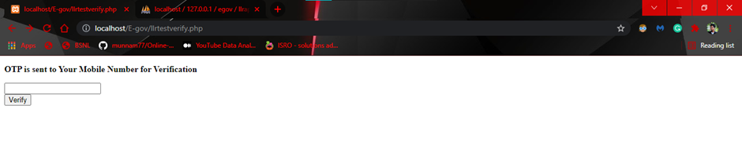

# Driving Licence Portal with real-time OTP function

## ABSTRACT:
The driving license portal is supposed to handle all the transactions related to driving licenses like receiving applications from the people and the issue of the license to the people. People can choose from different types of services provided like:
- Learner’s license
- Extending learner’s license
- Driving license
- Driving license renewal
- Duplicate driving license

## DESCRIPTION:
 - The project Driving License Portal is a web portal for services related to Driving License. This project is useful and essential as due to the pandemic; People cannot go out and use the services of RTO related to driving licenses. With the help of a web portal, people can stay home and use the services provided by the government online and get their License
without any difficulties. The project is not only useful for citizens but also for the government as the system removes physical forms and documentation making the entire system online, the government saves a lot of money as well as citizens. Also, the employees can use the system to provide results to the license test attendees.
 - The project consists of two modules, User and Employee. The user and employee modules have different services and functionalities. The user can register to the portal. The user can log in to the portal. The User can apply for a Learner’s license. The User can take the Learner’s license test online. The User can change the details of their LLR. The portal verifies the user using OTPs before providing access to change the details of the LLR and before the Test. The User can book a slot for the driver's license if they have passed their LLR test. The User can change the address on their driver's license. The user can view their license using the portal. The portal verifies the user before providing them with slot booking and change of address.
 - The Employees of the RTO office can log in to the system by using the credentials provided by the government. The Employees can enter the LLR no of the applicant and the date of the test and award them the result after the Driving License test.

## OBJECTIVES:
The Objectives of the project are as follows:
-  To create an online Driving License Portal
-  To create an Online Learner’s License Test
-  To make the existing Driving License System simple.
-  To Provide most of the services provided by the RTO Office Online.
-  To create an employee interface to assign results for the driving test attendees.

## PROPOSED SYSTEM:
- Online computer-based test for learner’s license.
- Temporary driving license number after passing the driving test.
- Making the entire system online.

## Architecture

## Activity Diagram

## UseCase Diagram

## Interface(sample images)

## DATABASE:
- Tables Structure

## FUTURE SCOPE:
The Project has a good future scope as this project is only developed for a small area of people. The Project can expand by providing services to the entire state. Fingerprint identification can be included to verify the users before posting driving test results. Newer technologies could be included to get better user verification better and easier  interaction and increase the overall efficiency of the project.
